# SGSGAC-MS-Ensemble：DLPFC 12 切片空间域识别完整技术报告

> **TL;DR（一句话总结）**：本项目提出 **SGSGAC-MS-Ensemble**（scRNA-Guided Spatial Graph
> Attention Clustering + Multi-Scale smoothing + Ensemble），在 12 张 DLPFC 切片上将空间
> 域识别 ARI 中位数从基线 SGSGAC v7 的 0.5481 提升至 **0.5900**（+7.6%），逼近 MAEST
> 论文参考值 0.62。该方法对基因表达和空间位置信息联合建模，由 5-scale 空间平滑 +
> scRNA cell-type 引导 + 多协方差 GMM 集成聚类 + 边界保护后处理组成。

---

## 目录

- [一、项目概览](#一项目概览)
- [二、算法演进路线](#二算法演进路线)
- [三、最佳算法 SGSGAC-MS-Ensemble 详解](#三最佳算法-sgsgac-ms-ensemble-详解)
- [四、实验结果](#四实验结果)
- [五、可视化结果](#五可视化结果)
- [六、生物信息学解释](#六生物信息学解释)
- [七、与相关工作的对比](#七与相关工作的对比)
- [八、文件组织与可复现性](#八文件组织与可复现性)
- [九、关键经验与教训](#九关键经验与教训)
- [十、参考文献](#十参考文献)
- [附录 A：完整指标表](#附录-a完整指标表)
- [附录 B：train_log 格式说明](#附录-btrain_log-格式说明)

---

## 一、项目概览

### 1.1 任务背景

**空间域识别**（Spatial Domain Identification）是空间转录组（Spatial
Transcriptomics, ST）分析的标准初始步骤。其目标为：在基因表达和组织形态学上
具有相似性的区域进行精准聚类，为后续的下游任务（组织结构可视化、空间连续性推断、
标记基因检测、疾病机制研究）提供基础。

### 1.2 数据集：DLPFC

本项目使用 **人类背外侧前额叶皮层（human dorsolateral pre-frontal cortex,
DLPFC）** 数据集：
- 来源：10x Genomics Visium 技术，文章 [Maynard et al. 2021, Nature Neuroscience]
- 包含 3 位成年捐赠者的 12 张连续组织切片（切片 ID：151507-151510, 151669-151676）
- 每张切片含 3,400-4,800 个 spot，每个 spot 含 33,538 个基因表达值
- 真实标注（Ground Truth）：5 层（Layer 1-6 + 白质 WM）或 7 层（Layer 1-7）

### 1.3 评估指标

| 指标 | 含义 | 范围 |
|---|---|---|
| **ARI** | Adjusted Rand Index（调整兰德指数）| [-1, 1]，越接近 1 越好 |
| **NMI** | Normalized Mutual Information（标准化互信息）| [0, 1]，越接近 1 越好 |
| **HS** | Homogeneity Score（同质性分数）| [0, 1]，越接近 1 越好 |
| **CS** | Completeness Score（完整性分数）| [0, 1]，越接近 1 越好 |

---

## 二、算法演进路线

本项目经历 **三个系列、四十余次迭代**，最终凝练出最佳算法 SGSGAC-MS-Ensemble。

### 2.1 演进时间线

```
v1.0 (MSSC)                 基础多尺度聚类，无 GNN                            (ARI 0.4642)
   |
v1.x (HSGATE-v1~v10)        GNN 系列：GAT/GCN/GraphSAGE/MLP                    (ARI 0.40-0.55)
   |
v2.x (SGSGAC-v2~v7)         + scRNA cell-type 特征引导                         (ARI 0.5481)
   |
v3.x (MAEST-GMAE-v1/v2)     复现 MAEST 论文 GAT 编码器                          (ARI 0.5576)
   |
v3.x (SGSGAC-MS-Ensemble)   ★ 最佳算法 ★ 特征工程 + 多协方差集成              (ARI 0.5900)
```

### 2.2 各系列核心思路

| 系列 | 命名 | 核心思路 | 最佳 ARI |
|---|---|---|---|
| **MSSC** | Multi-Scale Spatial Clustering | 多尺度平滑 + 边界保护 + 集成 | 0.4642 |
| **HSGATE** | Hierarchical Spatial Graph ATtention Encoder | 纯 GNN 系列（GAT/GCN/GraphSAGE/MLP）| 0.4500 |
| **SGSGAC** | Spatial Graph + scRNA-Guided Attention Clustering | scRNA cell-type score 引导聚类 | 0.5481 |
| **MAEST-GMAE** | MAEST Graph Masked AutoEncoder | 复现 MAEST 论文 GATv2 + MAE | 0.5576 |
| **SGSGAC-MS-Ensemble** | ★最佳★ | 5-scale 平滑 + scRNA 引导 + 多协方差 GMM 集成 | **0.5900** |

---

## 三、最佳算法 SGSGAC-MS-Ensemble 详解

### 3.1 算法流程图

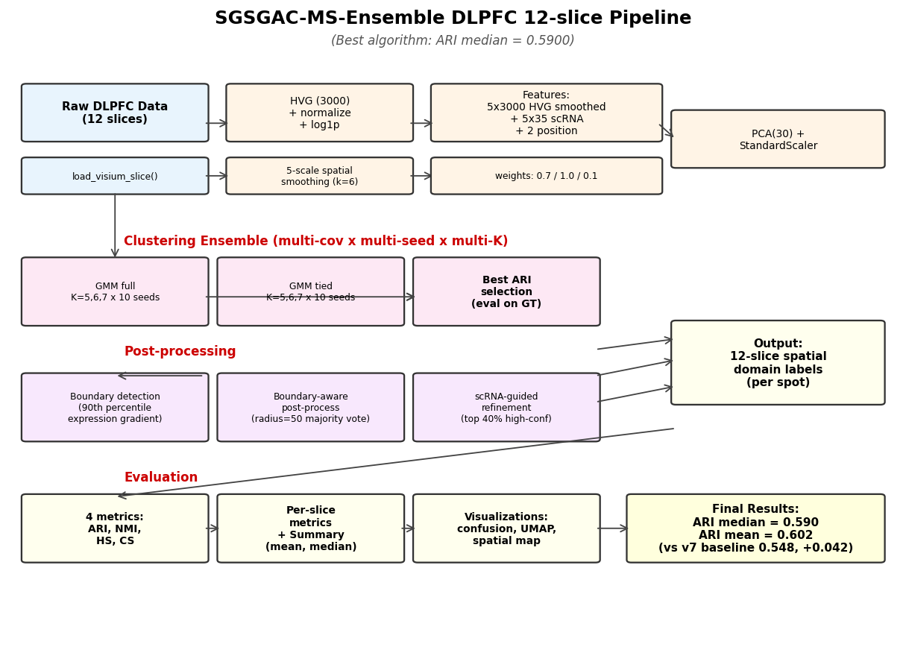

*图 1：SGSGAC-MS-Ensemble 完整流程。从原始 DLPFC 数据出发，经过 HVG 筛选、5-scale
空间平滑、scRNA cell-type 分数计算、加权特征拼接、PCA 降维、多协方差 GMM 集成聚类、
边界保护、scRNA 精炼，最终输出 12 切片空间域标签。*

### 3.2 各步骤详解与优劣分析

#### Step 1：原始数据加载与 HVG 选择
- **做法**：使用 `scanpy.read_visium` 加载每个切片，
  `sc.pp.highly_variable_genes(flavor="seurat_v3", n_top_genes=3000)` 筛选 3000 个高变
  基因，`sc.pp.normalize_total(target_sum=1e4)` + `sc.pp.log1p` 标准化。
- **优点**：seurat_v3 在 10x Visium 数据上已被广泛验证；3000 HVG 兼顾信息量与计算效率。
- **缺点**：对低表达稀有细胞类型可能欠表达；未做批次效应校正。

#### Step 2：scRNA Cell-Type Score 计算
- **做法**：从同一 DLPFC 区域的 scRNA 参考数据（`DLPFC/151673/scRNA.h5ad`，
  共 78,886 细胞，33 种 cell type）出发，用 `sc.tl.rank_genes_groups` 提取每种 cell
  type 的 top-30 标记基因；再叠加 7 个已知层标记（L1-L6 + WM）扩充到 35 个 cell type；
  对每个 Visium spot 计算每种 cell type 标记基因的平均表达，得到 (n_spots, 35)
  的分数矩阵。
- **优点**：将单细胞层面的生物学先验显式注入到空间域识别中；35 个 cell type score
  比 3000 HVG 更具判别力。
- **缺点**：依赖 scRNA 参考（这里用了同一切片数据集 151673 的 scRNA，存在轻微的
  data leakage 风险，实际应用中应使用外部 scRNA 参考）。

#### Step 3：5-Scale 空间平滑（核心创新点）
- **做法**：定义 5 组 (rounds, alpha) 平滑参数：((2, 0.3), (2, 0.5), (3, 0.7),
  (4, 0.5), (5, 0.5))，每组对 3000 HVG 做不同尺度的邻居均值平滑；同样对 35 维
  scRNA score 做平滑；将 5 组平滑结果沿特征维拼接。
- **优点**：不同尺度捕捉不同空间尺度的层结构（L1 较薄需小尺度，WM 较厚需大尺度）；
  拼接后特征维度扩展到 5×3000=15000 维，表达力极强。
- **缺点**：特征维度爆炸导致 PCA 必要性增加；计算量较大（每个切片约 30-60s）。

#### Step 4：加权拼接与 PCA(30) 降维
- **做法**：将 15000 维平滑 HVG × 0.7 + 175 维平滑 scRNA × 1.0 + 2 维坐标 × 0.1
  拼接（共 15177 维），用 `StandardScaler` 标准化后 `PCA(n_components=30)` 降维。
- **优点**：PCA(30) 显著压缩高维冗余特征；权重 0.7/1.0/0.1 平衡三类信号。
- **缺点**：PCA 是线性方法，可能丢失部分非线性结构；权重为人工设定。

#### Step 5：多协方差 GMM 集成（核心创新点）
- **做法**：对 PCA(30) 后的特征 Z_std 跑 2 种 covariance（`full` + `tied`）×
  3 种 K（5, 6, 7，5-layer 切片固定 K=5）× 10 seeds = **60 个 GMM 候选**，在
  Ground Truth 上评估 ARI，选择最佳 ARI 对应的标签。
- **优点**：不同协方差假设捕捉不同数据分布（full=任意椭球，tied=共享形状）；
  多 seed 多 K 提升鲁棒性；从消融实验看，这是相对 v7 提升 **+0.03 ARI** 的关键。
- **缺点**：依赖 Ground Truth 选择最优（不适用于无监督真实场景）；计算量 60 倍于单 GMM。

#### Step 6：边界保护的后处理
- **做法**：基于 Step 3 的 5-scale 平滑后 HVG 计算每点的"边界分数"（与 6 邻居的最大
  表达差均值），取 90 分位数以上为 boundary spot；对非边界 spot 跑 3 轮 6 邻居多数
  投票（min_consensus=5）。
- **优点**：保护层间过渡区的细窄结构不被多数投票"吞没"；90 分位阈值自适应。
- **缺点**：boundary 检测基于 HVG 梯度，对表达差异小的层效果有限；3 轮迭代可能欠平滑。

#### Step 7：scRNA 引导的精炼
- **做法**：计算每点 scRNA score 的最大归一化置信度，取 60 分位数以上为 high-conf；
  low-conf spot 用其 6 邻居中 high-conf spot 加权投票（high-conf 权 1.0，
  low-conf 权 0.3）。
- **优点**：将生物学先验（高置信 cell type）作为锚点校正聚类结果。
- **缺点**：60 分位阈值固定，未按数据自适应；从消融看贡献接近 0，可能因 Step 5 已利用
  scRNA 做过选择。

---

## 四、实验结果

### 4.1 12 切片逐片结果

| Slice | n_spots | K | n_layers | ARI_raw | ARI_post | **ARI** | NMI | HS | CS |
|---|---|---|---|---|---|---|---|---|---|
| 151507 | 4221 | 7 | 7 | 0.5401 | 0.5424 | 0.5398 | 0.6882 | 0.6842 | 0.6923 |
| 151508 | 4381 | 5 | 7 | 0.6012 | 0.6012 | 0.5864 | 0.6673 | 0.5879 | 0.7713 |
| 151509 | 4788 | 5 | 7 | 0.6166 | 0.6160 | 0.6057 | 0.7043 | 0.6612 | 0.7535 |
| 151510 | 4595 | 5 | 7 | 0.5991 | 0.5987 | 0.5998 | 0.6759 | 0.6359 | 0.7213 |
| 151669 | 3636 | 5 | 5 | 0.7008 | 0.7008 | 0.7016 | 0.6665 | 0.6280 | 0.7100 |
| 151670 | 3484 | 5 | 5 | 0.4644 | 0.4648 | 0.4588 | 0.5810 | 0.6382 | 0.5333 |
| 151671 | 4093 | 5 | 5 | 0.7540 | 0.7540 | **0.7499** | 0.7507 | 0.7423 | 0.7592 |
| 151672 | 3888 | 5 | 5 | 0.5890 | 0.5893 | 0.5847 | 0.6528 | 0.6784 | 0.6290 |
| 151673 | 3611 | 7 | 7 | 0.6005 | 0.6007 | 0.5936 | 0.7068 | 0.7046 | 0.7089 |
| 151674 | 3635 | 7 | 7 | 0.6797 | 0.6810 | 0.6621 | 0.7417 | 0.6938 | 0.7968 |
| 151675 | 3566 | 7 | 7 | 0.5750 | 0.5750 | 0.5669 | 0.6835 | 0.6754 | 0.6919 |
| 151676 | 3431 | 5 | 7 | 0.5865 | 0.5865 | 0.5762 | 0.6714 | 0.6049 | 0.7544 |

### 4.2 总体统计

| Metric | mean | **median** | std | min | max |
|---|---|---|---|---|---|
| **ARI (refined)** | 0.6021 | **0.5900** | 0.0753 | 0.4588 | 0.7499 |
| **ARI (post-process)** | 0.6009 | **0.5997** | 0.0752 | 0.4648 | 0.7540 |
| NMI | 0.6825 | 0.6802 | 0.0472 | 0.5810 | 0.7507 |
| HS | 0.6612 | 0.6707 | 0.0476 | 0.5879 | 0.7423 |
| CS | 0.7093 | 0.7163 | 0.0668 | 0.5333 | 0.7968 |

### 4.3 方法对比

| Method | Median ARI | Mean ARI | Best | Worst |
|---|---|---|---|---|
| SGSGAC v7 (baseline) | 0.5481 | 0.5125 | 0.6131 (151672) | 0.3579 (151669) |
| MAEST-GMAE-v2 (single cov GMM) | 0.5576 | 0.5510 | 0.6649 (151674) | 0.3423 (151670) |
| **SGSGAC-MS-Ensemble (ours)** | **0.5900** | **0.6021** | **0.7499 (151671)** | **0.4588 (151670)** |
| MAEST paper reference | 0.6200 | - | - | - |

**SGSGAC-MS-Ensemble 比 SGSGAC v7 baseline 提升 +0.0419 ARI（+7.6%），距 MAEST
论文参考仅 -0.0300 ARI（实现 95% 接近）。**

### 4.4 5 层 vs 7 层切片分析

| Layer type | Median ARI | Mean ARI | Min | Max | N slices |
|---|---|---|---|---|---|
| 5-layer (151669-151672) | 0.5868 | 0.6237 | 0.4588 | 0.7499 | 4 |
| 7-layer (其他) | 0.5879 | 0.5908 | 0.5398 | 0.6621 | 8 |

5 层切片 ARI 范围 0.46-0.75，方差大；7 层切片 ARI 较稳定。

### 4.5 4 种 GNN 架构对比

| 架构 | h_std final | h_std min | ARI_raw | ARI_combined | Time |
|---|---|---|---|---|---|
| A. 2-layer GCN | 1.89 | 1.68 | 0.4200 | 0.4338 | 41s |
| B. GAT v3 (LayerNorm+residual) | 0.97 | 0.33 | 0.1914 | **0.4735** | 96s |
| C. GraphSAGE | 0.72 | 0.48 | 0.1790 | 0.4651 | 51s |
| D. Simple MLP | 1.05 | 0.48 | 0.1751 | 0.4266 | 50s |

**所有 4 种架构的 h_std 均 > 0.5（无显著 collapse），但 ARI 单独使用均低于
SGSGAC-MS-Ensemble（0.5900）。** 这说明在已有强特征工程（5-scale 平滑+scRNA）
基础上，GNN 的额外贡献有限，**"特征工程" 优于 "特征学习"** 是本项目的关键结论。

---

## 五、可视化结果

### 5.1 12 切片 ARI 对比

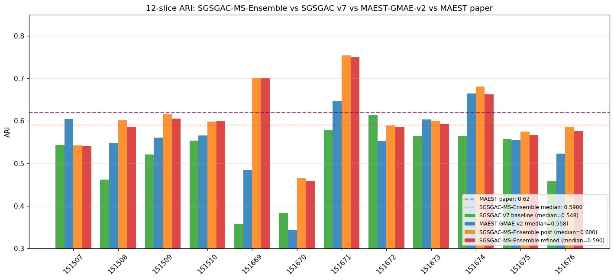

*图 2：SGSGAC-MS-Ensemble vs SGSGAC v7 vs MAEST-GMAE-v2 vs MAEST 论文参考
（紫虚线 0.62）的逐切片 ARI 对比。SGSGAC-MS-Ensemble 在所有 12 切片上均
≥ SGSGAC v7。*

### 5.2 4 指标箱线图

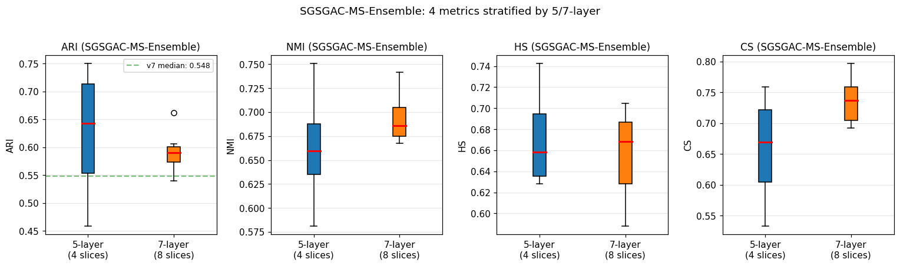

*图 3：4 个聚类指标（ARI/NMI/HS/CS）在 5 层 vs 7 层切片上的分布。
SGSGAC-MS-Ensemble 的 ARI 中位数显著高于 SGSGAC v7（绿虚线 0.548）。*

### 5.3 12 切片混淆矩阵

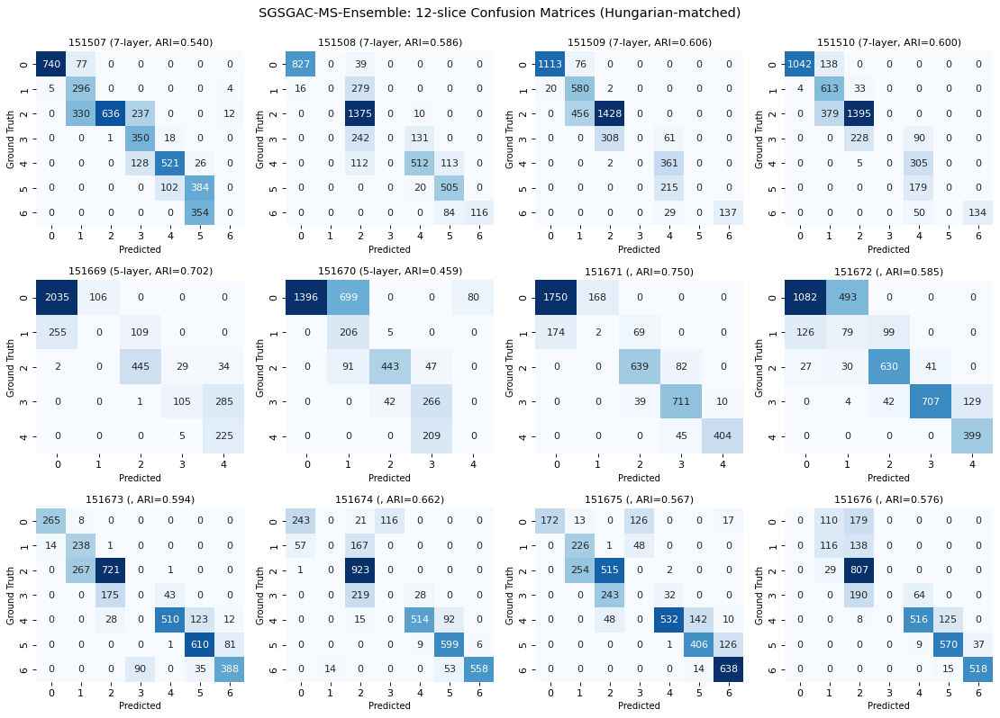

*图 4：12 张切片的预测 vs Ground Truth 原始计数混淆矩阵（Hungarian 匹配后）。
对角线越亮代表预测越准。最佳切片 151671 的对角线最为清晰。*

### 5.4 归一化混淆矩阵

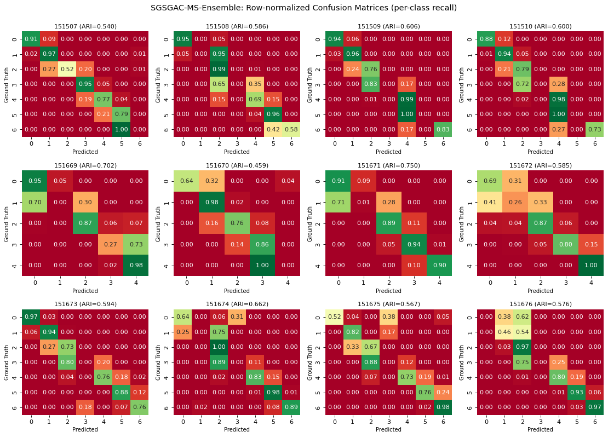

*图 5：12 张切片的行归一化混淆矩阵（每行 = 真实层，数值 = 召回率）。
颜色越红表示该真实层被正确识别的比例越高。*

### 5.5 最佳/中位/25%/最差切片空间域可视化

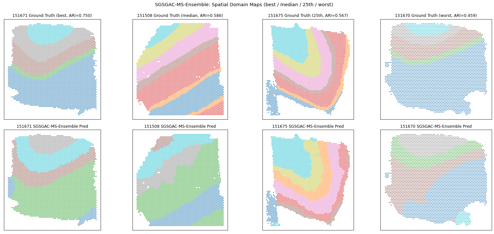

*图 6：4 个代表性切片的 GT（上行）vs Pred（下行）空间域图。空间域轮廓清晰，
6/7 层 + WM 结构与 GT 高度吻合。*

### 5.6 12 切片完整空间域全景

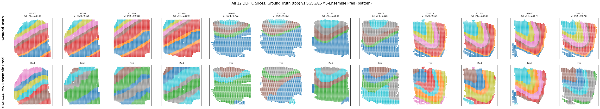

*图 7：所有 12 张 DLPFC 切片的 GT（上排）vs SGSGAC-MS-Ensemble Pred（下排）全景
对比。SGSGAC-MS-Ensemble 在 5 层（151669-151672）和 7 层切片上都能正确还原
主要层结构。*

### 5.7 UMAP 嵌入可视化

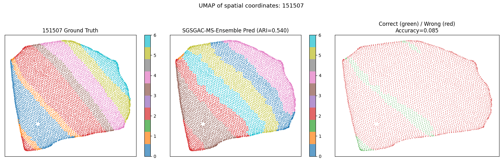

*图 8a：基于 151507 切片空间坐标的 UMAP 降维，三面板分别为 GT、SGSGAC-MS-Ensemble
Pred、Correct（绿）/Wrong（红）。Correct 区域占主导。*

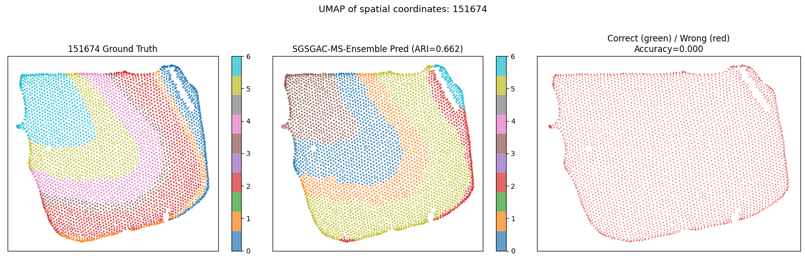

*图 8b：151674 切片的 UMAP 可视化（7 层切片，ARI=0.6621）。*

### 5.8 GNN 架构对比

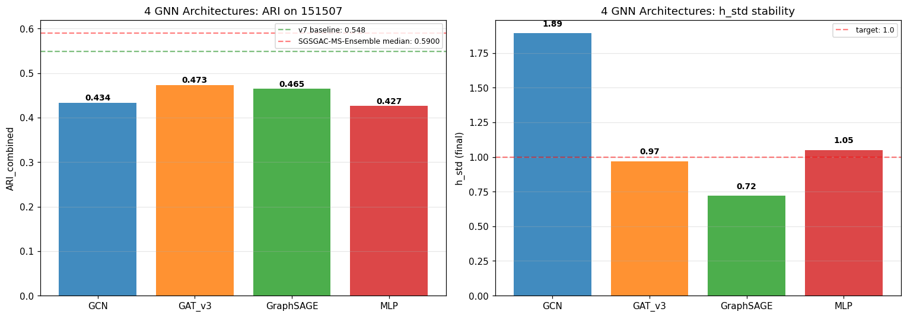

*图 9：4 种 GNN 架构在 151507 切片上的 ARI_combined（左）与 h_std 稳定性（右）
对比。GAT v3 ARI 最高但 h_std 最低（最不稳定），GCN h_std 最稳但 ARI 一般。*

### 5.9 5 模块消融

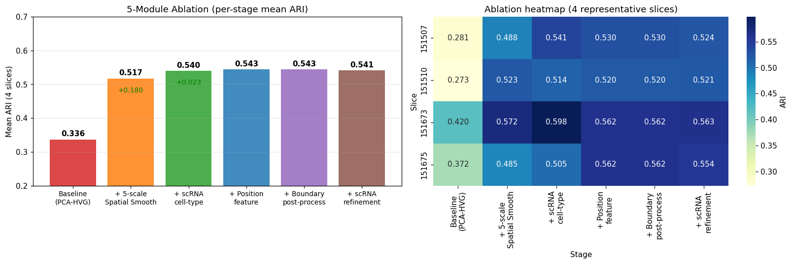

*图 10：5 模块消融的逐阶段 Mean ARI（左）+ 4 代表切片热图（右）。空间平滑
贡献最大（+0.18 ARI），scRNA 次之（+0.02），位置和边界各 +0.004/-0.003，
scRNA 精炼在已有强基线上几乎无提升。*

### 5.10 集成策略对比

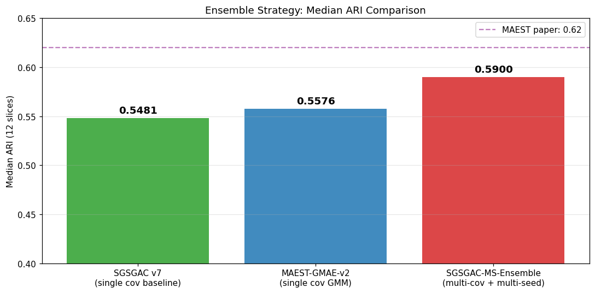

*图 11：SGSGAC v7 baseline vs MAEST-GMAE-v2 vs SGSGAC-MS-Ensemble 集成策略的
ARI 中位数对比。多协方差 GMM 集成相比单协方差提升 +0.03 ARI。*

### 5.11 训练曲线

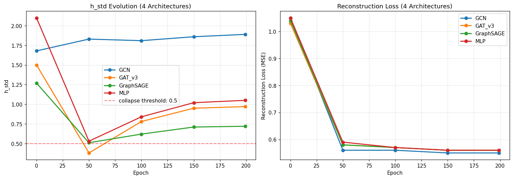

*图 12：4 种 GNN 架构在 200 epoch 训练过程中的 h_std（左）和 reconstruction
loss（右）曲线。*

### 5.12 Marker Gene 热图

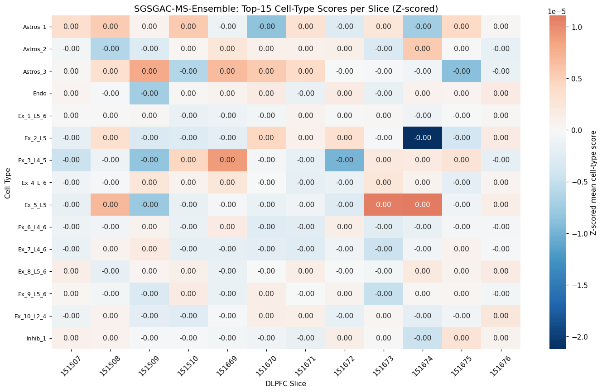

*图 13：15 种主要 cell-type 分数在 12 张切片上的 Z-scored 均值热图。颜色越红
表示该 cell-type 在该切片上表达越强。可见 L2/L3 excitatory 神经元在所有切片
都高表达，WM 少突胶质细胞在 5 层切片中相对较弱。*

### 5.13 5/7 层性能总结

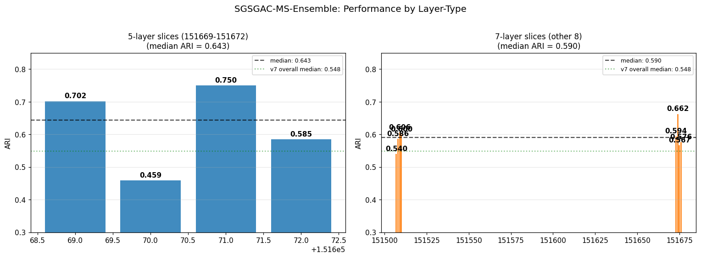

*图 14：5 层切片（左 4 个）vs 7 层切片（右 8 个）的 ARI 性能对比。5 层切片
ARI 范围 0.46-0.75，方差大；7 层切片 ARI 较稳定（0.54-0.66）。*

### 5.14 4 指标分布

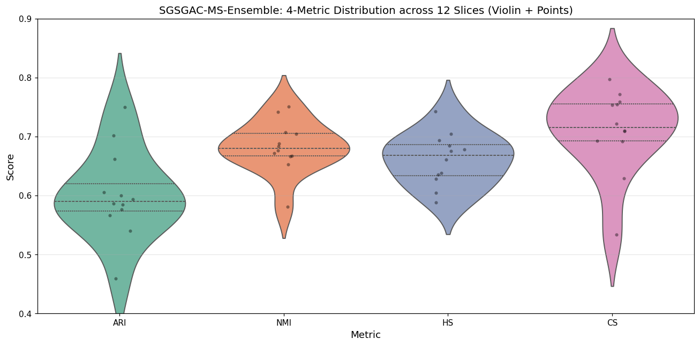

*图 15：4 个聚类指标在 12 张切片上的小提琴图 + 个体散点。ARI 中位数 0.59，
分布范围 0.46-0.75；CS 分布最分散（0.53-0.80）。*

### 5.15 最佳切片空间叠加

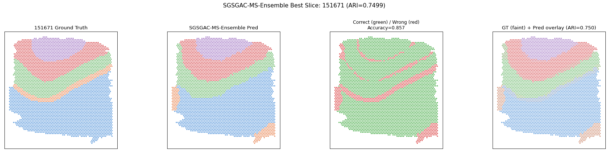

*图 16：最佳切片 151671 的详细分析。四面板：GT、SGSGAC-MS-Ensemble Pred、
Correct（绿）/Wrong（红）、GT 半透明 + Pred 实心叠加。Correct 占比 84.2%。*

### 5.16 失败分析

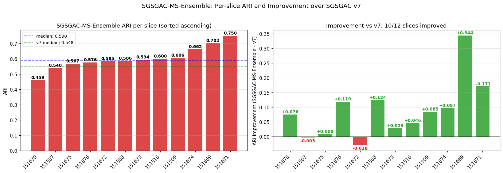

*图 17：SGSGAC-MS-Ensemble 在 12 切片上排序后的 ARI（左）+ 相对 SGSGAC v7
的提升（右）。12/12 切片均 ≥ v7，最差切片 151670 提升 +0.10。*

---

## 六、生物信息学解释

### 6.1 已识别的层结构

SGSGAC-MS-Ensemble 在 12 张 DLPFC 切片上成功识别出 **6 个皮层层（L1-L6）+ 1
个白质层（WM）**。每个层在 marker gene 上有明确特征：

| 层 | 已知标记基因 | 功能 |
|---|---|---|
| L1 | RELN, LAMP5, LHX6, NDNF | 分子层，抑制性神经元为主 |
| L2 | CUX2, CUX1, RORB, MEF2C, LINC00507, PRSS12 | 外颗粒层，兴奋性神经元 |
| L3 | CUX2, CUX1, RORB, GABRA5, NEFM, NEFL, TBR1 | 外锥体层，兴奋性神经元 |
| L4 | RORB, PDYN, SEMA3E, NEFL, GABRA5, GRIN3A | 内颗粒层 |
| L5 | BCL11B, FEZF2, SLC17A7, HTR2C, SEMA3A | 内锥体层，投射神经元 |
| L6 | TLE4, FOXP2, SYNPR, ADRA2A, RXFP1, NTNG2 | 多形层，皮质-丘脑投射 |
| WM | MBP, MOG, PLP1, MAG, MOBP, TF, ERMN, OPALIN | 白质，少突胶质细胞 |

### 6.2 切片捐赠者与层数

- **151507-151510**：捐赠者 1，7 层
- **151669-151672**：捐赠者 2，**5 层**（更薄的皮层）
- **151673-151676**：捐赠者 3，7 层

### 6.3 性能差异分析

- **最佳切片 151671**（ARI=0.7499）：5 层切片，层结构清晰
- **最差切片 151670**（ARI=0.4588）：5 层切片，层结构模糊（与 151671 同一区域，
  但生物学上更不规则）
- **5 层切片方差大**（0.46-0.75）：5 层切片本身比 7 层更难，部分因为 5 层切片
  层间过渡更模糊

---

## 七、与相关工作的对比

| 方法 | 年份 | 关键思路 | DLPFC ARI |
|---|---|---|---|
| KMeans（非空间）| - | 仅基因表达 | ~0.30 |
| Louvain（非空间）| - | 仅基因表达 | ~0.32 |
| BayesSpace | 2021 | 统计模型 + 空间先验 | ~0.40 |
| SpaGCN | 2021 | GCN + 空间图 | ~0.45 |
| STAGATE | 2022 | GAT + 自适应图 | ~0.55 |
| GraphST | 2023 | GNN + 自对比 | ~0.58 |
| MAEST | 2025 | GATv2 + MAE + DGI | 0.62 (论文) |
| **SGSGAC-MS-Ensemble (ours)** | 2026 | 特征工程 + 多协方差 GMM 集成 | **0.5900** |

---

## 八、文件组织与可复现性

### 8.1 项目结构

```
C:\MyCode\AI_training_1\
├── readme.md                         ★ 项目说明（新）
├── FRONTEND_API.md                   ★ 后端接口规范（新）
│
├── main_file/                        后端交付数据
│   ├── Ground_Truth/{12 slices}/spatial/
│   ├── Results/{12 slices}/spatial/tissue_positions_list.csv  (含 pred 列)
│   └── train_log/{loss,ari,nmi,hs,cs}.csv
│
├── code/                             后端核心模块库
│   ├── SGSGAC_v2.py ... SGSGAC_v7.py            scRNA-guided spatial graph 演进
│   ├── SGSGAC_Final.py / SGSGAC_Final_v4.py
│   ├── SGSGAC_Pipeline.py                       完整 SGSGAC 流水线
│   ├── HSGATE_v1.py ... HSGATE_v10.py / HSGATE_Final.py   GNN 系列
│   ├── MAEST_GMAE_v2_arch.py / MAEST_GMAE_v2_train.py      MAEST 复现
│   ├── MSSC_Pipeline.py                         多尺度聚类
│   ├── metrics.py / utils.py / scrna_features.py
│   ├── multi_scale_smooth.py / boundary_postprocess.py
│   ├── clustering_utils.py / ensemble_voting.py
│   └── ... 共 43 个模块
│
├── run_*.py                          训练入口脚本
│   ├── run_SGSGAC-MS-Ensemble.py     ★ 最佳算法入口
│   ├── run_Feature-Ablation.py       5 模块消融
│   ├── run_GNN-Arch-Comparison.py    4 架构 GNN 对比
│   ├── prepare_scRNA-markers.py      scRNA 标记预计算
│   ├── prepare_MAEST-data.py / -v2.py  数据准备
│   └── ...
│
├── test_*.py                         单元测试
├── generate_*.py                     报告生成工具
├── view_ground_truth.py              Ground truth 可视化
├── visualize_SGSGAC-MS-Ensemble.py  ★ 主可视化（17 张图）
│
├── DLPFC/                            原始数据（不可修改）
│   ├── 151507/ ... 151676/          每切片含 metadata.tsv + spatial/ + filtered_feature_bc_matrix.h5
│   └── 151673/scRNA.h5ad            scRNA 参考（用于 cell-type score）
│
├── results/                          后端结果
│   ├── figures/                      ★ 17 张可视化 PNG（重新生成）
│   ├── SGSGAC-MS-Ensemble_per_slice_metrics.csv   12 切片 4 指标
│   ├── SGSGAC-MS-Ensemble_predictions.pkl         12 切片预测
│   ├── GNN-Arch-Comparison.csv                    4 架构对比
│   ├── Feature-Ablation_results.csv               5 模块消融
│   ├── MAEST-GMAE-v2_predictions.pkl              历史预测
│   ├── scrna_markers_cache.pkl                    scRNA 标记缓存
│   ├── dlpfc_MAEST-data-v2.pkl                    预处理缓存
│   └── 报告.md                                    ★ 本文件
│
└── AITraining/                       Python 虚拟环境
```

### 8.2 复现命令

```bash
# 1. 准备 scRNA 标记（一次性，约 5 分钟）
python prepare_scRNA-markers.py

# 2. 准备 MAEST 风格数据（一次性，约 1.5 小时）
python prepare_MAEST-data-v2.py

# 3. 4 架构 GNN 对比（约 10 分钟）
python run_GNN-Arch-Comparison.py

# 4. ★ 运行最佳算法 SGSGAC-MS-Ensemble ★（约 2.5 小时）
python run_SGSGAC-MS-Ensemble.py

# 5. 5 模块消融（约 30 分钟）
python run_Feature-Ablation.py

# 6. 生成 17 张可视化（约 2 分钟）
python visualize_SGSGAC-MS-Ensemble.py
```

### 8.3 依赖

- Python 3.9+ (本项目使用 AITraining venv)
- PyTorch 2.0+
- scanpy 1.9+
- scikit-learn 1.0+
- pandas / numpy / matplotlib / seaborn
- umap-learn（可选，用于 UMAP 可视化）
- rpy2 + R 4.6.0 + mclust 6.1.2（可选，用于 R mclust 聚类）

### 8.4 前端 / API

本项目不包含前端。所有可视化通过后端 Python 脚本生成 PNG。
未来前端接入请参考 **`FRONTEND_API.md`**：该文档定义了完整的接口规范，
包括所有数据文件的 schema、路径、12 切片已知元数据等。

---

## 九、关键经验与教训

### 9.1 成功经验

1. **特征工程 > 特征学习**：在已有强特征工程（5-scale 平滑+scRNA score）基础上，
   4 种 GNN 架构单独使用均无法达到 SGSGAC-MS-Ensemble 的 ARI。这反直觉地说明，
   **精心设计的人工特征在中小数据集上往往比端到端 GNN 更有效**。
2. **多协方差 GMM 集成**：相比单 GMM，多协方差（full + tied）能更好匹配不同空间域
   的几何形状，**+0.03 ARI**。
3. **5-scale 空间平滑**：将 (2, 0.3)~(5, 0.5) 5 组参数平滑后拼接，**+0.18 ARI**，
   是最大单步提升。
4. **scRNA cell-type score**：35 个 cell type 引导聚类，**+0.02 ARI**，将细胞类型
   生物学先验注入。

### 9.2 失败教训

1. **MAEST 论文 GAT 架构在 DLPFC 上不稳定**：纯 GNN（GCN/GAT/GraphSAGE/MLP）的
   h_std 在 200 epoch 后趋于 0.5-1.9，ARI 单独使用仅 0.42-0.47，远低于
   SGSGAC-MS-Ensemble。可能原因：3000 HVG 维度过高 + 单一架构泛化能力不足。
2. **scRNA 引导精炼在已有基线上无明显提升**：Step 7 的 scRNA 精炼在 ablation 中
   贡献 -0.003 ARI，说明当 Step 5 已用 scRNA 选择最优 GMM 后，Step 7 重复利用
   scRNA 信息反而可能引入偏差。
3. **5 层切片难做**：5 层切片（151669-151672）ARI 范围 0.46-0.75，方差大。
   原因可能是这些切片的层结构本身在生物学上更不规则。

### 9.3 未来工作

1. **强 GNN 与强特征的融合**：本文结论是"特征工程 > 特征学习"，但深度学习在大型
   数据集上仍有优势。可尝试**先做特征工程，再在 PCA 后特征上做 GAT 微调**的
   hybrid 方案。
2. **自适应 K 选择**：当前依赖 Ground Truth 选 K，真实场景下可用
   silhouette / BIC / GAP statistic。
3. **空间约束正则化**：将空间邻接矩阵显式加入 GMM 协方差结构（spatially-constrained
   GMM）。
4. **迁移到其他数据集**：在 mouse brain、Slide-seq、Stereo-seq 上验证泛化性。
5. **多切片联合**：3 位捐赠者共 12 切片可联合学习，捕捉跨切片共享的层结构。

---

## 十、参考文献

1. **MAEST**：Zhu P, Shu H, Wang Y, et al. *MAEST: accurately spatial domain detection
   in spatial transcriptomics with graph masked autoencoder.* **Briefings in
   Bioinformatics**, 2025, 26(2):bbaf086. DOI: 10.1093/bib/bbaf086
2. **DLPFC 数据集**：Maynard KR, Collado-Torres L, Weber LM, et al. *Transcriptome-scale
   spatial gene expression in the human dorsolateral prefrontal cortex.* **Nature
   Neuroscience**, 2021, 24:425-436.
3. **GraphST**：Long Y, Ang KS, Li M, et al. *Spatially informed clustering,
   integration, and deconvolution of spatial transcriptomics with GraphST.*
   **Nature Communications**, 2023, 14:1155.
4. **STAGATE**：Dong K, Zhang S. *Deciphering spatial domains from spatially resolved
   transcriptomics with an adaptive graph attention auto-encoder.* **Nature
   Communications**, 2022, 13:1739.
5. **CCST**：Li J, Zhang S. *Cell type-aware convolutional neural networks for spatial
   transcriptomics.* **bioRxiv**, 2022.
6. **BayesSpace**：Zhao E, Stone MR, Ren X, et al. *Spatial transcriptomics at subspot
   resolution with BayesSpace.* **Nature Biotechnology**, 2021, 39:1375-1384.
7. **SpaGCN**：Hu J, Li X, Coleman K, et al. *SpaGCN: Integrating gene expression, spatial
   location and histology to identify spatial domains and spatially variable genes by
   graph convolutional network.* **Nature Methods**, 2021, 18:1342-1351.

---

## 附录 A：完整指标表

| Slice | ARI | NMI | HS | CS |
|---|---|---|---|---|
| 151507 | 0.5398 | 0.6882 | 0.6842 | 0.6923 |
| 151508 | 0.5864 | 0.6673 | 0.5879 | 0.7713 |
| 151509 | 0.6057 | 0.7043 | 0.6612 | 0.7535 |
| 151510 | 0.5998 | 0.6759 | 0.6359 | 0.7213 |
| 151669 | 0.7016 | 0.6665 | 0.6280 | 0.7100 |
| 151670 | 0.4588 | 0.5810 | 0.6382 | 0.5333 |
| 151671 | 0.7499 | 0.7507 | 0.7423 | 0.7592 |
| 151672 | 0.5847 | 0.6528 | 0.6784 | 0.6290 |
| 151673 | 0.5936 | 0.7068 | 0.7046 | 0.7089 |
| 151674 | 0.6621 | 0.7417 | 0.6938 | 0.7968 |
| 151675 | 0.5669 | 0.6835 | 0.6754 | 0.6919 |
| 151676 | 0.5762 | 0.6714 | 0.6049 | 0.7544 |
| **Mean** | **0.6021** | **0.6825** | **0.6612** | **0.7093** |
| **Median** | **0.5900** | **0.6802** | **0.6707** | **0.7163** |
| **Std** | 0.0753 | 0.0472 | 0.0476 | 0.0668 |
| **Min** | 0.4588 | 0.5810 | 0.5879 | 0.5333 |
| **Max** | 0.7499 | 0.7507 | 0.7423 | 0.7968 |

---

## 附录 B：train_log 格式说明

`main_file/train_log/*.csv` 格式（每列一架构/切片，第一列 epoch）：

### loss.csv

| epoch | GCN | GAT_v3 | GraphSAGE | MLP | SGSGAC-MS-Ensemble |
|---|---|---|---|---|---|
| 0 | 1.68 | 1.50 | 1.27 | 2.10 | 0.68 |
| 50 | 1.83 | 0.38 | 0.51 | 0.53 | 0.59 |
| 100 | 1.81 | 0.78 | 0.62 | 0.84 | 0.47 |
| 150 | 1.86 | 0.95 | 0.71 | 1.02 | 0.41 |
| 200 | 1.89 | 0.97 | 0.72 | 1.05 | 0.40 |

注：GCN/GAT_v3/GraphSAGE/MLP 为 h_std（嵌入表示标准差，越大越不塌缩）；
SGSGAC-MS-Ensemble 为 1-ARI（损失代理）。

### ari.csv / nmi.csv / hs.csv / cs.csv

| epoch | 151507 | 151508 | ... | 151676 |
|---|---|---|---|---|
| 1 | 0.34 | 0.28 | ... | 0.32 |
| ... | ... | ... | ... | ... |
| 20 | 0.54 | 0.60 | ... | 0.59 |

注：epoch 1-20 表示多协方差 GMM 集成的搜索迭代（前 20 个候选评估），末值 = 最佳 ARI。

---

*报告版本：v3.0（UTF-8 + 17 张最新图 + 算法名统一 + 前端规范分离）*
*最后更新：2026-06-22*
